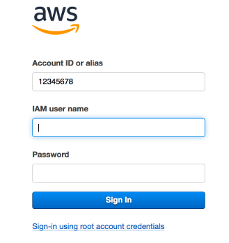

# IAM & EC2 Demo
## Preamble
This is the first of a number of demos within AWS specifically around the console.  
In this demo we are going to look at Identity & Access Management (IAM) as well as the Elastic Compute (EC2) services.  
Following the instructions will show you how to create a user within IAM and then use that user to create some servers within the EC2 service.

## Requirements
You should already have already followed the initial instructions to run the setup ([here](./README.md)).

## DEMO

##### Login to the console  
Connect into AWS as the root/administrator of the account using the root console access.

##### IAM  
This quick demo shows how to create a user and add 2 Factor Authentication to that user.  
Once we have created the user we will use it for the rest of the demo(s).  
Note: It is not a good idea to continually use the root login for day-to-day administration tasks and therefore we create individual administrator accounts for people to login with. 

1. From the "Services" menu go to:
  * Security, Identity & Compliance -> IAM
  * Users-> Add User (On the screen below)
  
    
    
1. Within the “Add User” screen:  
  * Username – pick a name you can remember!  
  * Access Type - Enable AWS Management console access, you do not need programmatic access.  
  * For the console password use a custom password and remember it.  
  * Uncheck the require password reset  

1. Go through to the permissions screen:  
  * Attach existing policies directly  
  * Select/tick administrator access  

1. Skip through Tags, Review and then Create User.
  Once you have created the user close the success screen.

1. Go back to the users screen within IAM.  
  * Select the user you just created
  * Take a note of the console sign in link (as below); you will need this shortly.

    

1. Within the summary screen for that user select security credentials
  * Click on Assigned MFA (Multi-Factor Authentication) device and follow the instructions to set it up.

1. Logout of the console; you are now going to login with the user you just created.

1. Paste the URL that you took note of above into your browser.  
This will give you a screen such as:

 

Note that you are logging in with the account ID as one of the fields on this screen. This is because you are now logging in as an IAM user within the account and not as a root account. 

1. Login to the console using the username and the password you just created (This will require MFA at this point).  
You are now logged in with the user you just created with the role of administrator (the policy you set) using MFA.

There are no charges for extra users so no costs will be incurred from the above.

####End of IAM Demo - What have we done?
To be completed

####EC2 Demo

######Creating Windows instances
In this section we are showing how to create windows instances and connect to them remotely.   
The servers will only be billed as we are using them in an “on demand” fashion so once we are done with them we can shut them down.

####EC2 demo setup
To demonstrate EC2 we initially need to setup a keypair.  
From the console go to Computing -> EC2 -> Networking & Security -> Key Pairs  
Create a key pair. Call it something you can remember: e.g. *yourname*DemoKeyPair  
Save this to disk, you will need this later so remember where you save it.  

There are a number of instance types we can use (https://aws.amazon.com/ec2/instance-types/) but we are going to use the medium General Instance types (T and M) for this demonstration. 

1. From the Console Services menu go to:
  * Compute -> EC2 
  * Instances -> Instances 
  * Click “Launch new Instance”

In this section we are selecting what type, and how many, we want of a particular instance. 

On the first screen ensure you select the correct Amazon Machine Image (AMI).
Either type “windows” into the search bar (and hit enter) or scroll down.
Using either method find the AMI: Microsoft Windows Server 2012 R2 Base
Select this AMI, this will take you to the next screen.

Choose “t2.medium” on the “Choose an Instance Type” screen.

On the “Configure Instance Details” screen select the following:

* Number of instances: 5
* Network: Demo VPC
* Subnet: Demo Public Subnet A (or B or C)
Leave the rest of the settings as they are.

Hit Review and Launch. Then Launch.

When you hit Launch it will ask you for the key pair to use; this will be the one you created earlier. So “Choose an existing key pair” from the drop down and then select the demo key pair from earlier (this should be the default). 
Acknowledge the message and “Launch Instances”.

The key pair is important as it is the only way to de-crypt the administrator password for that instance, so if you do not have the key pair you created earlier then you will not be able to decrypt the password and login.

You will be presented with the confirmation screen to which you can now “View Instances” and see what you have created.

Connect to one of the instances.
Once the instances are running state and both status check are passed we can connect. 
The network has been setup to allow remote connections from the internet; this would generally be bad practice however these servers will be destroyed after this test.
The network itself is described and created in the original YAML file that was run earlier; you can open this file and see how the entire network was created.

Select an instance and choose connect – this will bring up a dialog box which you can then follow the instructions. 
To retrieve the administrator password it will ask you for the PEM file which you created earlier; remember where you stored this on disk and provide it to the screen, this will decrypt the password. 
This is actually an important security step, it means that if you do not have a key (previously) you will not be able to connect to that instance. The downloads of the keys only happens once (at creation) so you cannot download someone else key and connect into the instance.
Use the download RDP link provided and it will launch in the Microsoft Remote Desktop software you installed earlier (or on Windows is inbuilt).

Once logged in you are now connected to one of the instances that are running within your cloud.

Once finished terminate the instances.

