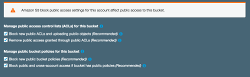
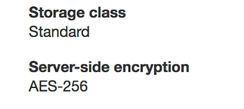

# Simple Storage Service (S3) Demo
## Preamble
Within this demo we are going to look at how to create a simple storage area (bucket) and then upload some content to it.  
Amazon S3 is an object storage service with 99.999999999% durability and has many management capabilties.  
  
## S3 Demo
In this Demo we are firstly going to create a bucket in the most straightforward manner and then upload a file to it.  
Once that is done we can create a second bucket with further features enabled and upload files.  

#### Create some storage
1. From the "Services" menu go to:
    * Storage -> S3  
    Note that your region is no longer "Ireland" as the S3 buckets are in a global namespace meaning that names are unique to S3 and not just to the region.  
    Buckets are still held in a region which you assign but they need to uniquely named globally.
    
2. Click "Create Bucket"
   This will bring up the Create Bucket screen (as below) and initially we just need to create a name.  
   A name is provided below but please change the date/number to something unique.
   * Name: awsconsoledemo-28022019
   * Region: Ireland
   * Click "Create"
   
   
3. Look at the bucket you have just created.  
   It reads "Buckets and objects not public" which stops any public access.  
   
4. Download the Well Architected Framework from [here](https://github.com/limivorous/aws-console-demo/Resources/AWS_Well-Architected_Framework_Nov_2018.pdf)

5. Click on the bucket name you have just created (it will be a hyperlink).

6. Click on the "Upload" button.  
   Click on the "Add Files" button and find the Well Architected Framework you just downloaded.  
   Click "Upload" to upload that file to S3.

This file is now securely stored within S3.  
Although that was a simple process we can enable a few more features to enhance the capabilities of our storage.  
This time we are going to enable encryption by default and versioning on our storage area (bucket).

#### Create some encrypted storage
This time we are going to create an encrypted, versioned bucket for our storage.

1. Within the S3 screen on the console (Services -> Storage -> S3)
   * Click "Create Bucket".  
   This will bring up the same screen as before but we are going to undertake a few more steps.
   * Name: awsconsoledemo-28022019-extra
   * Region: Ireland
   * Click "Next"  

2. On the "Configure Options" Tab:
   * Select the checkbox for "Keep all versions of an object in the same bucket."
   * Select the checkbox for "Automatically encrypt objects when they are stored in S3".
   * Leave the encryption as AES-256 as per the image below
   * Click "Next"
   
    

3. On the "Set Permissions" Tab:\
   * Leave all options ticked as per the image below
   This has the effect of denying public access to this bucket even if granted through other permissions.  
   These controls make it more difficult than ever to unwittingly opening up a bucket to public access.  
   

4. * Click "Next"  
   * Click "Create Bucket"
   We have now created a bucket with encryption by default and versioning of objects.  
   To test this we are now going to upload some files.
   
5. Download the AWS Overview from [here](https://github.com/limivorous/aws-console-demo/Resources/aws-overview-dec-2018.pdf)

5. Click on the bucket name you have just created, remember it has "extra" on the end of the name.

6. Click on the "Upload" button.  
   Click on the "Add Files" button and find the AWS Overview document you just downloaded.  
   Click "Upload" to upload that file to S3.
   
7. Select the checkbox next to the file you just uploaded.
   This will bring up a dialog box which will tell you more about the file.  
   Firstly you can see it is encrypted within this box:
   
   Then you can see it is the latest file:
   
   
